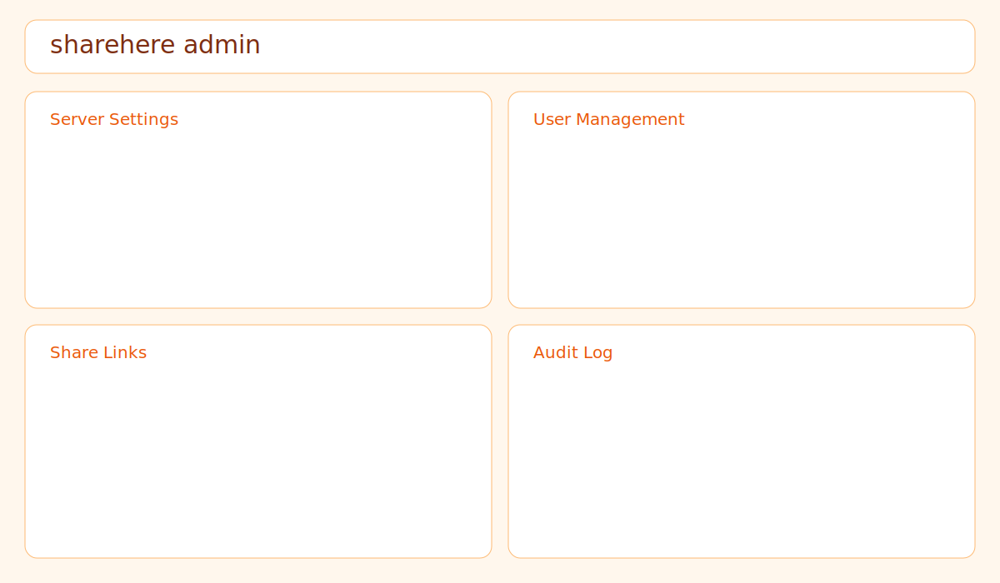

# sharehere

`sharehere` is a production-oriented cross-platform CLI for securely sharing a local directory over LAN with a modern web file browser.

- Serve current directory by default: `sharehere`
- Embedded web UI (Go `embed`) with uploads, previews, temporary links, admin panel, and themes
- SQLite-backed auth/session/audit/link storage
- Argon2id password hashing
- LAN URL discovery + terminal QR code on startup

## Highlights

- Directory browser: breadcrumbs, sort/filter, hidden-file toggle, list/grid view
- Finder-style actions menu: one button per item for download/zip/share/copy/rename/delete
- Uploads: drag/drop, multi-file, progress, policy enforcement
- Temporary links: browse/download/upload modes, expiry, revoke, audit
- Admin settings: guest modes, upload policy, readonly mode, file-op toggles, theme controls
- Auth/session security: Argon2id, server-side sessions, login lockout/backoff, CSRF checks
- Download helpers: streamed ZIP for folders, generated `scp`/`rsync` commands
- CLI management: users, links, themes, config inspection, interactive init

## Security Model

`sharehere` is LAN-accessible by default (`0.0.0.0`). Treat it as a network service.

- Password storage uses **Argon2id** with per-password salt and encoded parameters
- Sessions are random server-side tokens stored in SQLite
- Cookies are `HttpOnly`, `SameSite=Lax`, and `Secure` when HTTPS is enabled
- Login is rate-limited with escalating lockouts
- CSRF validation is enforced on state-changing authenticated endpoints
- Path resolution blocks traversal and symlink escapes outside share root
- Uploads are size-limited server-side and streamed to disk (no full-file buffering)
- Directory ZIP downloads are streamed

### LAN Exposure Warning

If auth is disabled (`--auth off`) or guest access is enabled, devices on the same network can access content. Use trusted networks, firewall rules, and HTTPS where appropriate.

## Installation

### Quick install (macOS/Linux)

Installer downloads source, builds for the current host platform, and installs globally (fallback to `~/.local/bin`).

Requires a local Go toolchain (`go` command available).

```bash
curl -fsSL https://raw.githubusercontent.com/matthewsawatzky/sharehere/main/install.sh | sh
```

Optional installer env vars:

- `SHAREHERE_VERSION=v1.2.3`
- `SHAREHERE_INSTALL_DIR=$HOME/.local/bin`
- `SHAREHERE_RUN_INIT=1`
- `SHAREHERE_REPO=<owner/repo>`

### Build from source

```bash
go build -o sharehere ./cmd/sharehere
./sharehere init
./sharehere
```

## First-run setup

```bash
sharehere init
```

Wizard configures:

- bind/port/basepath
- auth + guest mode defaults (recommended profile: `auth=on`, `guest-mode=read`)
- upload policy defaults
- admin account bootstrap (if no admin exists)

## Usage

Serve current directory:

```bash
sharehere
```

Serve an explicit path:

```bash
sharehere serve /path/to/share
```

Common flags:

```bash
sharehere --bind 0.0.0.0 --port 7331 --open
sharehere --readonly --guest-mode read
sharehere --https --cert ./certs/sharehere.crt --key ./certs/sharehere.key
sharehere --basepath /files
```

## CLI Reference

```text
sharehere
sharehere serve [path]
sharehere init
sharehere config
sharehere user add|list|remove|passwd|disable|enable
sharehere link create [path] --expiry 1h --mode browse|download|upload
sharehere theme list|set
sharehere version
```

## HTTPS

### Self-signed helper

```bash
./scripts/gen-cert.sh ./certs
sharehere --https --cert ./certs/sharehere.crt --key ./certs/sharehere.key
```

### mkcert (recommended for trusted local certs)

- Install `mkcert`
- Generate certs for hostnames/IPs you use
- Start with `--https --cert ... --key ...`

Windows note: generate cert/key via OpenSSL or mkcert in PowerShell, then pass paths with `--cert` and `--key`.

## Screenshots

Dashboard:


Admin panel:



## Data and Configuration

- Config path: platform config dir (`$SHAREHERE_CONFIG` override supported)
- Default DB path: platform data dir (`--data-dir` override)
- SQLite stores users, sessions, settings, share links, and audit logs

## Development

```bash
npm install
npm run build:tailwind
go test ./...
go build ./cmd/sharehere
```

Tailwind usage is intentionally lightweight: compiled CSS is emitted to `internal/webui/static/tailwind.css` and served via Go `embed`. There is no runtime frontend framework and no watcher/build daemon required.

## Release Automation

GitHub Actions workflow builds:

- Linux: `amd64`, `arm64`
- macOS: `amd64`, `arm64`
- Windows: `amd64`, `arm64`

Artifacts and `checksums.txt` are attached to tag releases (`v*`).

## License

MIT
